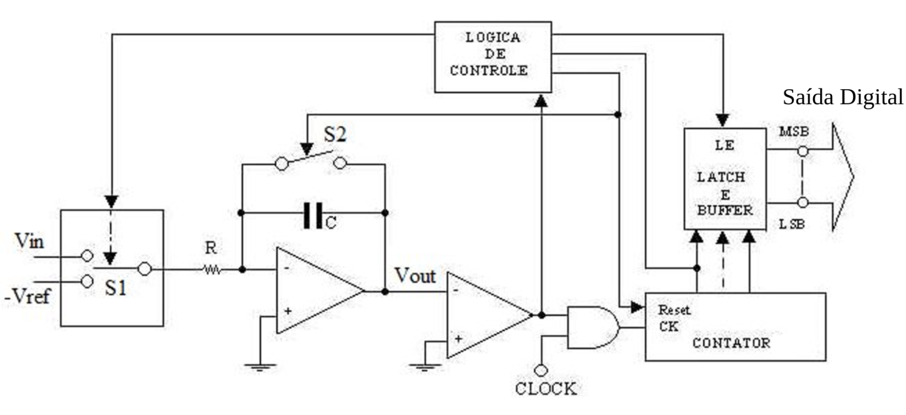

# Projeto de Conversor Analógico para Digital (ADC) - Parte 4

Nesta parte do projeto, será apresentada a implementação de um controlador para um conversor analógico para digital (ADC) do tipo rampa dupla, utilizando a linguagem de descrição de hardware (HDL). O controlador é responsável por gerar os sinais de controle, realizar a contagem dos períodos $t_x$ e $t_m$ e atualizar os displays de 7 segmentos com o valor convertido.
## Teoria da Rampa Dupla
O conversor analógico para digital de dupla rampa busca converter uma tensão de entrada $V_{in}$ em um sinal digital, que pode ser representado em um display de sete segmentos como feito em alguns multímetros. Para realizar tal conversão, faz-se uso do seguinte sistema integrador:

  
  
<em>Figura 1 - Circuito do conversor analógico para digital de rampa dupla</em>

Nesse circuito, a conversão inicia com a chave $S_1$ em $V_{in}$, o que leva a integração desse sinal durante o período fixo $T_1$ em $V_{out}$. Após esse momento, a chave $S_1$ muda para $-V_{ref}$, cujo sinal de $V_{out}$ passa a ser integrado até atingir tensão nula, durante um tempo $T_2$. Enquanto isso, a máquina de $n$ estados estará contando o tempo de integração a partir do período do $clock$. 

Dessa forma, temos o seguinte gráfico de tensão em função do tempo:

  
  
<em>Figura 2 - Gráfico da tensão Vout em função do tempo para diferentes valores de Vin do conversor analógico para digital de rampa dupla.</em>

Durante a subida e a descida do sinal, temos a seguinte fórmula, respectivamente, que vem do integrador:

$$V_{out}=-\frac{V_{in}\cdot t}{R\cdot C}$$
$$V_{out}=-\frac{V_{in}\cdot 2^n \cdot T_{ck}+ V_{ref}\cdot t}{R\cdot C}$$
De onde podemos tirar que:

$$T_1=2^n\cdot T_{ck} $$
$$T_2=\frac{V_{in}}{V_{ref}}\cdot 2^n \cdot T_{ck}$$
Assim, como a contagem $x$ da máquina de estados é dada por $\frac{T_2}{T_{ck}}$, temos que:

$$x=\frac{V_{in}}{V_{ref}}\cdot 2^n \Rightarrow V_{in}=x\cdot V_{ref}\cdot 2^-n$$
Ou seja, a tensão de entrada $V_{in}$ pode ser convertida em um sinal lógico a partir da contagem $x$ feita pela máquina de estados.

## Implementação do Controlador
O controlador do ADC, representado na Figura 6, é composto por uma máquina de estados que gera os sinais de controle, contadores decimais, registradores e conversores BCD para 7 segmentos. 

Os contadores são responsáveis pela contagem dos períodos $t_x$ e $t_m$, enquanto os registradores armazenam o valor da última contagem para exibição nos displays.

O Teoria do controlador segue as seguintes etapas:

1. O acionamento da chave `inicio` inicia a operação do conversor. Depois a chave `ch_vm` é ativada. A máquina de estados, então, aguarda o final da contagem do contador, sinalizado por `enb_3=1`.
2. Após o período $t_x$ , a chave `ch_ref` é acionada, e a máquina de estados aguarda a tensão na saída do integrador atingir o valor zero, sinalizado por `Vint_z=1`, a qual é simulada _300clocks_ depois do sinal `enb_3=1`.
3. Quando `Vint_z=1`, o valor dos contadores é transferido para os registradores no próximo ciclo de clock, atualizando os displays com o novo valor de tensão. 
4. A operação é encerrada com o acionamento da chave `ch_zr`, que leva a saída do integrador a zero, e a reinicialização dos contadores com o valor zero.

